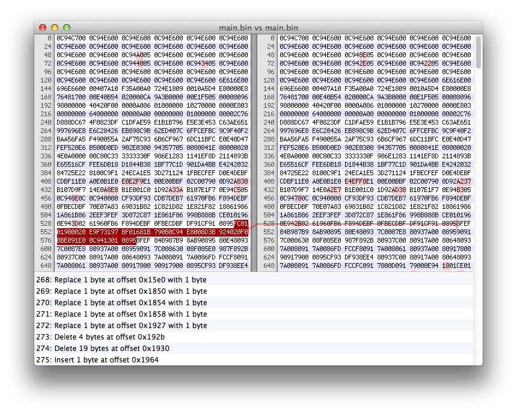

<h1>&mu;pdates</h1>

An experiment to validate the need for &mu;pdates.  
Christophe VG <contact@christophe.vg>  
[https://github.com/christophevg/mupdates](https://github.com/christophevg/mupdates)

## Introduction

In a related project, [rose](https://github.com/christophevg/rose), I'm trying to combine reactive programming, over the air programming (OTAP) and a minimal bootloading VM to create an environment that allows for very small (program) updates to a running system.

The idea comes from systems that require frequent and by itself small updates to their functionality. Examples of such systems that come to mind are intrusion detection systems (IDS), which I investiged in my masters' [thesis](https://github.com/christophevg/thesis). But I envisage future internet of things (IoT) things to expose the same behavior. Say you have the next cool wearable _thing_ which monitors your every move. Just like your smarty-pants phone, you'll want to stuff it with apps - maybe we'll call them wapps - that each do something different with the recorded data. Given the very limited resources on such a _thing_, limiting the impact of these updates will be (battery-)life saving issue.

But is this really an issue? Is a solution such as [rose](https://github.com/christophevg/rose) an actual solution to the problem?

This repository tries to answer at least the first question: "_is applying readily available solutions really resulting in an unacceptable overhead?_"

## Counter Approach

To validate the problem, I'm going to compile a series of programs, starting from a basic light reading app, adding more and more functionality and see what happens to the compiled image.

An alternative to the solution proposed by [rose](https://github.com/christophevg/rose) might be simply recompiling a complete new image and only transfering the binary <tt>diff</tt>. Let's see...

### Environment

I'm once again using my basic hardware abstraction layer (HAL), [moose](https://github.com/christophevg/moose). Although I could actually deploy everything on my embedded system of choice, the xt0f-004, there is no need for. At least not at first. But we'll pretend it's the target platform.

## Let There be Light

We start of by defining a base application. It's a simple light sensor driver, sending readings every minute to the sink in the meshed network.

```c
#include <avr/io.h>
#include <util/delay.h>

#include "moose.h"
#include "light_sensor_config.h"
#include "xbee_send_to_coordinator.h"

int main(void) {
  avr_init();
  avr_adc_init();

  xbee_init();
  xbee_wait_for_association();

  avr_clear_bit(LIGHT_SENSOR_PORT, LIGHT_SENSOR_PIN);

  union {
    uint16_t reading;
    uint8_t  bytes[2];
  } light;

  while(TRUE) {
    light.reading = avr_adc_read(LIGHT_SENSOR_PIN);
    xbee_send_bytes(light.bytes, 2);
    _delay_ms(60000L);
  }

  return(0);
}
```

I've extracted some parts of the code, but this is the entire base application. So how big is that?

```bash
$ avr-objcopy -I ihex -O binary main.hex main.bin
$ wc -c main.bin
    6502 main.bin
```

I use a binary format, to remove all excess baggage due to formatting etc.

## Adding Alerts

Now we want to add alerting functionality, which sends out and alert if the reading passes a certain threshold. The diff summarizes the changes...

```bash
$ diff -u main.c ../alert/main.c 
--- main.c	2015-06-17 14:59:49.000000000 +0200
+++ ../alert/main.c	2015-06-17 16:18:18.000000000 +0200
@@ -5,6 +5,18 @@
 #include "light_sensor_config.h"
 #include "xbee_send_to_coordinator.h"
 
+#include <string.h>
+
+void xbee_send_string(const char* str) {
+  xbee_send_bytes((uint8_t*)str, strlen(str));
+}
+
+void alert(uint16_t light_reading) {
+  if(light_reading > 700) {
+    xbee_send_string("alert, light above 700");
+  }
+}
+
 int main(void) {
   avr_init();
   avr_adc_init();
@@ -22,6 +34,7 @@
   while(TRUE) {
     light.reading = avr_adc_read(LIGHT_SENSOR_PIN);
     xbee_send_bytes(light.bytes, 2);
+    alert(light.reading);
     _delay_ms(60000L);
   }
```

So what does that look like in binary?

```bash
$ avr-objcopy -I ihex -O binary main.hex main.bin
$ wc -c main.bin
    6568 main.bin
```

That's 66 bytes more than the base application. Makes sense, but what's the actual difference? I first launched my Hex Friend. Just from the looks of it, it seems _a lot_ has changed. About 275 changes were detected.

<p align="center">

</p>

I believe that <tt>bsdiff</tt> ([http://www.daemonology.net/bsdiff/](http://www.daemonology.net/bsdiff/)) can be considered representative for creating small binary diffs:

```bash
$ bsdiff ../base/main.bin main.bin main.diff
$ wc -c main.diff
     571 main.diff
```

Let's not take into account that <tt>bspatch</tt> requires <tt>bzip2</tt> and _n+m+O(1)_ bytes of memory,... and simply look at the bytes that would get send over the network to our _thing_: In stead of 6568 bytes for an entire new image, we could send a mere 571 bytes, or only about 8,70%.

## Facilitating Adding Functionality

The idea is to update the functionality of a running device, by adding or removing functionality. Added functionality of course uses the existing data sources of the device, so I'm first going to rewrite the base application to allow for easier additions of such functionality. Hopefully, this will simplify the diff, and make it smaller.

```c
#include <avr/io.h>
#include <util/delay.h>

#include "moose.h"
#include "light_sensor_config.h"
#include "xbee_send_to_coordinator.h"

// global light reading information
union {
  uint16_t reading;
  uint8_t  bytes[2];
} light;

// a prototype for handlers
typedef void (*handler_t)(void);

// an implementation of the handler, reporting it
void report(void) {
  xbee_send_bytes(light.bytes, 2);
}

// a datastructure holding handlers
handler_t handlers[] = {  &report,  NULL };

int main(void) {
  avr_init();
  avr_adc_init();

  xbee_init();
  xbee_wait_for_association();

  avr_clear_bit(LIGHT_SENSOR_PORT, LIGHT_SENSOR_PIN);

  while(TRUE) {
    light.reading = avr_adc_read(LIGHT_SENSOR_PIN);
    int i = 0;
    while(handlers[i]) { handlers[i++](); }
    _delay_ms(60000L);
  }

  return(0);
}
```

The changes are trivial:

* the <tt>light</tt> variable is made global, so it is accessible from any module-scope defined function
* a prototype for handlers is introduced as <tt>handler_t</tt>
* the reporting of the sensed value is turned into a <tt>report</tt> function
* a list of <tt>handlers</tt> is created and populated with the <tt>report</tt> function
* a generic loop, traverses through all handlers and executes them

With these changes in place, the overal size of the full image results in...

```bash
$ make clean all
--- compiling main.c
--- linking main.elf
--- creating HEX image
--- creating EEPROM
--- creating extended listing file
--- creating symbol table

main.elf  :
section          size      addr
.data             118   8388864
.text            6398         0
.bss              797   8388982
.stab            1416         0
.stabstr          228         0
.comment           17         0
.debug_info      1938         0
.debug_abbrev    1833         0
.debug_line        29         0
.debug_str        662         0
Total           13436

--- creating main.bin
--- sizing main.bin
    6516 main.bin
```

So this hosting version only adds 14 bytes to the overall base application, bringing the cost to enable hosting to a mere 0.22%. I think that's an affordable abstraction.

### Hosting Alerts

Reimplementing the alert example on top of this hosting infrastructure looks like this:

```bash
> #include <string.h>
> 
> void xbee_send_string(const char* str) {
>   xbee_send_bytes((uint8_t*)str, strlen(str));
> }
> 
21a28,33
> void alert(void) {
>   if(light.reading > 700) {
>     xbee_send_string("alert, light above 700");
>   }
> }
> 
23c35
< handler_t handlers[] = {  &report,  NULL };
---
> handler_t handlers[] = { &report, &alert, NULL };
```

We simply add the functions we need, and add a reference to the new handler to the list of handlers. The resulting binary diff...?

```bash
$ make diff
--- compiling main.c
--- linking ../host/main.elf
--- creating HEX image
--- creating ../host/main.bin
--- linking main.elf
--- creating HEX image
--- creating main.bin
--- creating binary diff
--- sizing main.diff
     139 main.diff
```

Alrighty, now the binary diff is only 139 bytes or about 25% of the original diff with no hosting facilities.

_more to come..._
